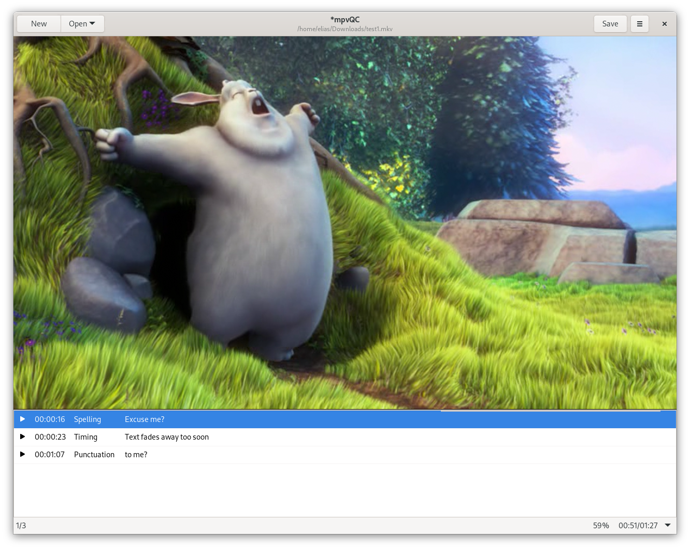

**mpvQC is a libmpv based application for the creation of quality control reports of video files.**



## Installation

Currently this application runs on Linux and on Windows (MSYS2).  
Binaries for Windows will be provided once `v1.0` gets released.

**Install**

<!-- 
### Flatpak

1. Download the flatpak file.
2. Install it either via software center or via cli:  
   `flatpak install com.github.mpvqc.mpvQC.flatpak`
3. The application should now be accessible via application menu.  
   Else running `flatpak run com.github.mpvqc.mpvQC` will start the application.
   
Running `flatpak remove com.github.mpvqc.mpvQC` will remove the software.

-->

* Make sure `python>=3.6` and `mpv>=0.29.0` are installed on the system
* Make sure build dependencies `meson` and `ninja` are installed
* Install dependencies `pip install -r requirements.txt`

In the root directory of the project run:

```shell script
meson . .builddir
ninja -C .builddir
ninja -C .builddir install
```

The application now pops up in the system search or can be executed via `mpvQC`.

**Uninstall**

```shell script
ninja -C .builddir uninstall
```

## Keybindings

Access the keyboard shortcut menu via menu or via shortcut `CTRL + F1`.  

## FAQ

* Are there plans for Windows Binaries?
  > Yes, we will provide binaries with `v1.0`
* How can I contribute code to the project?
  > Please read the **development section** from the [contributing guide](CONTRIBUTING.md)  
  > Then create or select an issue or tackle one of the todos in the code
* How can I contribute translations to the project?
  > Please read the **translation section** from the [contributing guide](CONTRIBUTING.md)